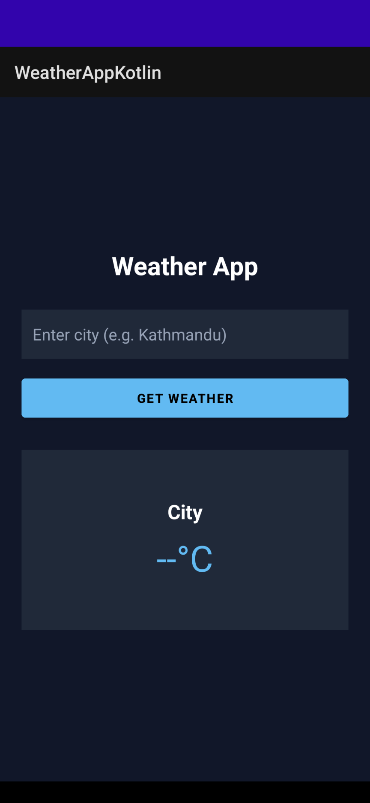
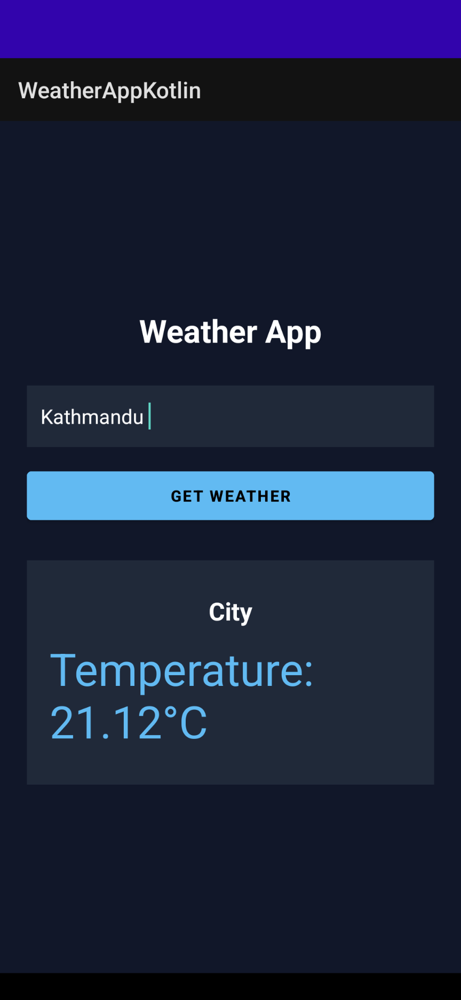

# 🌦️ Weather App (Kotlin)

A simple Android Weather App built with Kotlin that shows real-time weather using the OpenWeatherMap API.

## ✨ Features
- Search weather by city  
- Shows temperature, humidity, and weather conditions  
- Simple and clean UI  

## 📸 Screenshots
  
  

## 🛠️ Built With
- Kotlin  
- Android Studio  
- OpenWeatherMap API  

## 🚀 How to Run
```bash
git clone https://github.com/Abhishekshak/WeatherAppKotlin.git
